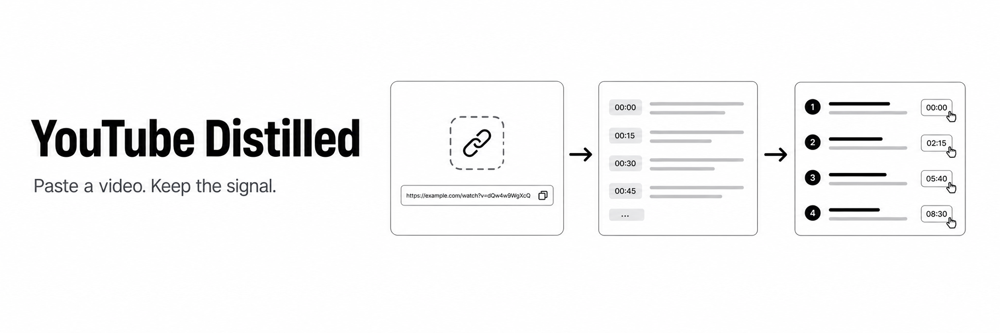

<p align="center">
  
</p>

<p align="center">
  <strong>Turn a YouTube URL into a useful brief—with source-backed timecodes you can watch on demand.</strong>
</p>

<p align="center">
  
  
  
  
</p>

YouTube Distilled is a minimal, local-first web app for extracting the signal from long videos. It gathers the video title, creator, description, duration, chapters, and available captions, then asks your authenticated Codex CLI or Claude Code installation to produce a concise, structured analysis.

## Highlights

- **Dense, predictable briefs** — summary, key takeaways, concepts, practical uses, critical view, and final compression.
- **A ten-minute watch guide** — only the most valuable source-backed moments, with clickable timecodes.
- **Floating YouTube player** — opens at the selected moment, snaps to any corner, and toggles fullscreen.
- **Codex or Claude** — choose the provider, model, and reasoning level from the settings menu.
- **Visible performance** — see the total run time and expand a per-step timing breakdown.
- **Local app state** — the UI and API run on your machine, and analysis sessions are not persisted.

## Quick start

### Requirements

- macOS
- Node.js 22.13 or newer
- Python 3
- An authenticated [Codex CLI](https://github.com/openai/codex) or [Claude Code](https://docs.anthropic.com/en/docs/claude-code/overview) installation

### Install and run

```sh
git clone https://github.com/32andrii23/youtube-distilled.git
cd youtube-distilled
./scripts/start.sh
```

The startup script prepares missing JavaScript and Python dependencies, starts the API at `127.0.0.1:4322`, starts the app at `localhost:4321`, and opens it in your browser. Press `Ctrl+C` to stop both services.

To create a global Zsh command, add this to `~/.zshrc` and replace the path with your clone location:

```zsh
youtube-distilled() {
  cd /path/to/youtube-distilled && ./scripts/start.sh
}
```

Reload your shell, then launch the app from anywhere:

```sh
source ~/.zshrc
youtube-distilled
```

## How it works

1. The Python service validates and normalizes the YouTube URL.
2. It fetches public metadata and selects the best available caption track, preferring creator-provided English captions.
3. The transcript is timestamped and combined with the video context and analysis prompt.
4. The selected local CLI performs the analysis and may use its web tools for supporting context.
5. The React interface renders the Markdown brief and turns supported timecodes into player controls.

If YouTube does not expose captions, the app says so and works from the remaining metadata and web context. It never invents timestamps by design, but—as with any AI-generated analysis—you should verify important claims against the source.

## Output

Every brief follows the same useful structure:

1. Video summary
2. Key takeaways
3. “I only have 10 minutes” watch guide
4. Important concepts and terms
5. Hidden value
6. Practical use
7. Critical view
8. Final compression

## Stack

| Layer | Technology |
|---|---|
| Interface | React, TypeScript, Vite, Tailwind CSS, shadcn/ui |
| API | Python, FastAPI, Uvicorn |
| Video context | YouTube watch metadata and `youtube-transcript-api` |
| Analysis | Codex CLI or Claude Code |

## Privacy and limitations

- The server binds to `127.0.0.1`; it is not exposed to your network by default.
- The app does not store summaries or AI sessions.
- Requests still reach YouTube and the provider services used by your chosen CLI.
- Caption availability and quality depend on the source video and YouTube access.
- Available models depend on your installed CLI version and account access.

## Development

```sh
npm test
npm run lint
```

The test command builds the frontend, runs the TypeScript tests, and runs the Python unit tests.

## License

Released under the [MIT License](LICENSE).
